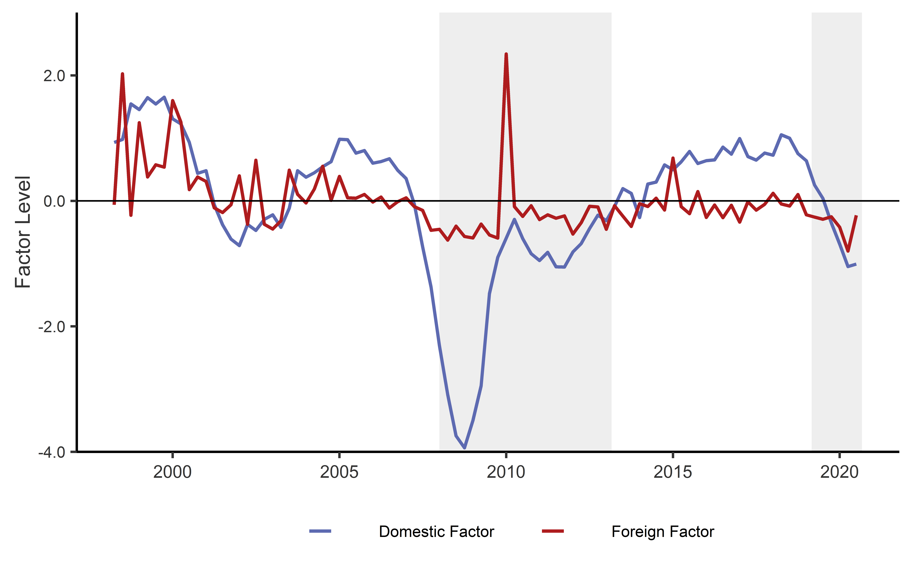

---
# An instance of the Portfolio widget.
# Documentation: https://wowchemy.com/docs/page-builder/
widget: pages

# This file represents a page section.
headless: true

# Order that this section appears on the page.
weight: 60

title: Research
subtitle: ''

content:
  # Page type to display. E.g. project.
  page_type: page

---

## Works in Progress

  

    

      
      

        <h5 class="card-title">Research Contribution 1</h5>
        
Authors: John Doe, Jane Smith

        
Published in: Journal of Economic Analysis

        
A brief summary of the research contribution.

      

    

  

  

    

      
      

        <h5 class="card-title">Research Contribution 2</h5>
        
Authors: John Doe, Jane Smith, Michael Brown

        
Published in: Journal of International Economics

        
A brief summary of the research contribution.

      

    

  

## Working Papers

  

    

      
      

        <h5 class="card-title">
Measuring Economic Activity in the Presence of Superstar MNEs</h5>
        
with Giorgi Nikolaishvili

        
Revise and resubmit, Economic Letters

        
In 2015, changes to Irish tax legislation, known as the “2015 Finance Act”, coincided with a 25 percent annual increase in real gross domestic product. We provide evidence confirming the convictions of existing literature that the presence of large multinational enterprises (MNEs) is likely to have “distorted” Irish GDP, a measure previously considered to be a reliable proxy of domestic economic activity. Furthermore, we provide an alternative method of statistically isolating the variation in GDP growth attributable solely to domestic activity growth to infer the prevailing state of the Irish economy. Our findings imply a 21% lower level of GDP relative to the official measure recorded for 2020. We suggest that our methodology may be applied by policymakers in small open economies to improve the accuracy of growth and business cycle monitoring.

        
<a href="https://drive.google.com/file/d/1sp0DtQIbv6Ih-Ee5VeyfHJyYRajFUhSV/view?usp=sharing">Draft</a>

      

    

  

  

    

      
      

        <h5 class="card-title">Firm-Level Productivity and Corruption</h5>
        
Field Paper

        
Using the World Bank Enterprise Surveys and an augmented proximity-concentration model based on the Helpman et al. (2004) framework, I test whether host country corruption influences the composition of local exporters and multinational enterprise (MNE) affiliates. In this setting, a firm’s ‘type’ is assumed to be determined by an exogenously drawn productivity level and country-specific fixed costs. I find evidence that greater degrees of host corruption cause underling fixed costs to rise, reflected by differences in average firm producitivty, both at the country and country-industry levels. In particular, local corruption contributes to increased exporter fixed costs for both domestic firms and MNEs, costs which only relatively more productive firms can afford. A one unit intensification of corruption is associated with 2.53 to 4.81 percent and 1.41 to 2.53 percent higher average productivity across reamining exporting MNE affiliates and domestically-owned firms, respectively, relative to domestically-owned non-exporters. These findings suggest that corruption is a deteriment to export participation and limit participation to a subset of relatively more productive firms that can afford the associated costs.

        
<a href="https://drive.google.com/file/d/1dEb9KDMtkKT0ieu9V19rE3baRl0dcxxw/view?usp=share_link">Draft</a>

      

    

  

